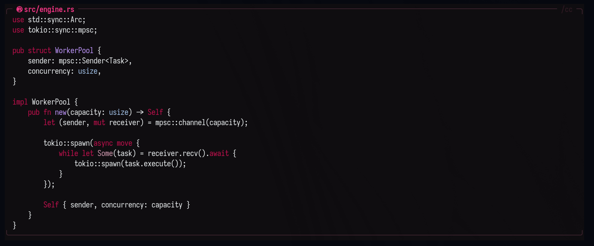
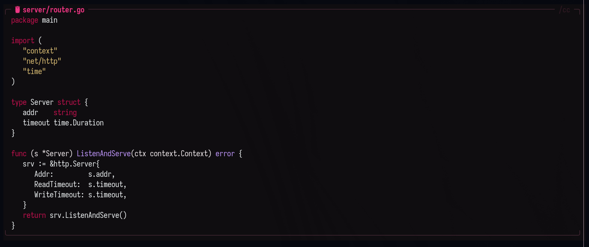
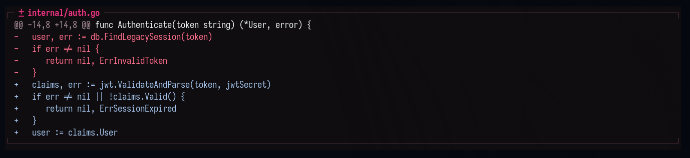
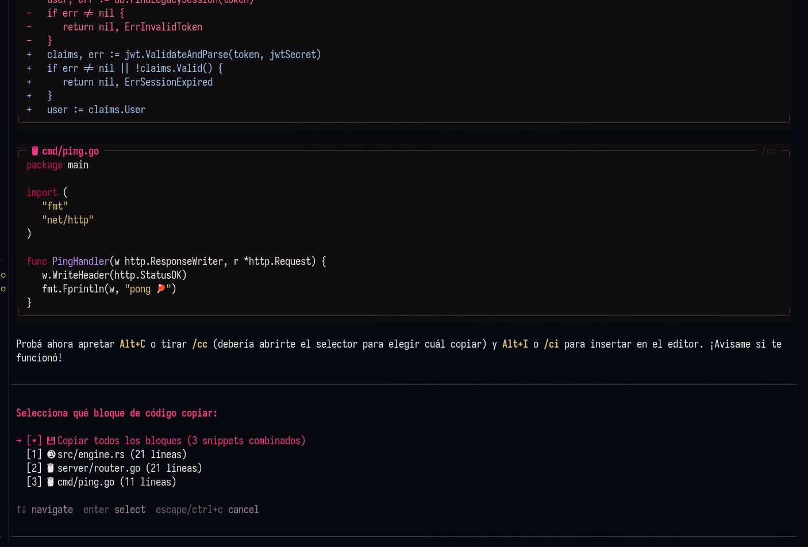
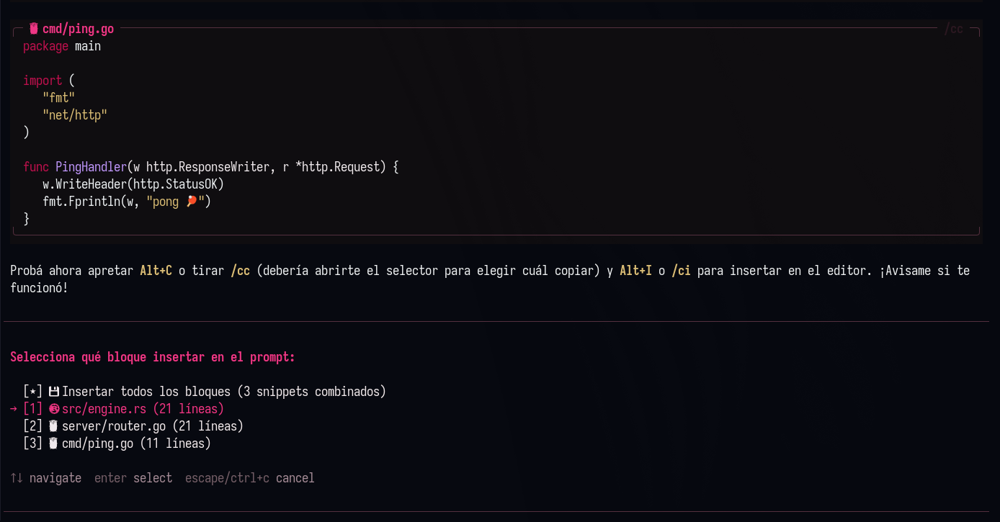

# pi-messages 🎨

Extensión estética y de productividad para **Pi Coding Agent** que transforma los bloques de código planos de Markdown en tarjetas de terminal estilizadas, legibles y diseñadas para el flujo de trabajo moderno (con copiado y pegado inteligente sin fricción).

---

## 📸 Vista Previa

<p align="center">
  
</p>

### ✨ Estilo de Bloques y Diffs

| Código con Icono y Encabezado (`Rust` / `Go`) | Diffs de Git con Bordes Redondeados |
| :---: | :---: |
|  |  |

### ⚡ Atajos de Teclado Interactivos

| Menú de Copiado Rápido (`Alt+C` / `/cc`) | Menú de Inserción en Editor (`Alt+I` / `/ci`) |
| :---: | :---: |
|  |  |

*(Todo el bloque cuenta con fondo tenue continuo, cabecera con icono Nerd Font del lenguaje o ruta de archivo, minileyenda `/cc`, esquinas redondeadas simétricas `╭ ╮` y `╰ ╯`, y ausencia de barras laterales en el código para copiar limpio con el mouse).*

---

## ✨ Características Principales

### 1. Bordes Limpios y Simétricos (Anti-Copy-Borders)
* **Marco redondeado:** Cabecera `╭─ ... ─╮` y pie de cierre `╰─ ... ─╯`.
* **Copiado limpio con mouse:** Las líneas de código **no tienen barras verticales `│` en los costados**. Podés hacer triple clic para copiar una sola línea o arrastrar el mouse sobre el bloque y copiar código puro sin caracteres de caja que rompan tu editor o terminal.

### 2. Soft-Wrap Inteligente (Anti-Code-Loss)
* Si una línea excede el ancho de tu terminal, **no se trunca con `…`**.
* Utiliza `wrapTextWithAnsi` nativo para dividir la línea respetando la sangría, el color de fondo y el resaltado de sintaxis. El código siempre se mantiene 100% íntegro.

### 3. Iconos Nerd Font Automáticos
* Detecta más de 40 lenguajes y asigna su glifo icónico (` ts`, ` go`, ` rust`, ` py`, ` bash`, ` diff`, `󰡨 docker`, `󰘦 json`, etc.).
* Si el bloque contiene una ruta (ej: ````typescript:src/auth.ts````), la cabecera muestra el icono y el nombre del archivo.

### 4. Copiado Keyboard-Driven (`Alt+C` y `/cc`)
* **`Alt+C`**: Atajo global para copiar al portapapeles en cualquier momento.
* **Menú selector interactivo:** Si hay múltiples bloques, abre un selector flotante (`ctx.ui.select`) para elegir cuál copiar.
* **`/cc all` (Copiado total):** Concatena todos los bloques de código real en un solo movimiento.
* **Exclusión total de diffs:** Los bloques `diff` y `patch` se renderizan estéticamente pero **se excluyen automáticamente del menú de copiado y de `/cc all`**, ya que no son código ejecutable.

### 5. Inserción Inteligente en el Prompt (`Alt+I` y `/ci`)
* **`Alt+I`**: Atajo global para precargar código directamente en el editor de Pi.
* **Menú selector interactivo:** Muestra la lista de snippets disponibles para insertar en el prompt.
* **Pegado resumido nativo:** Utiliza `ctx.ui.pasteToEditor`. Si el código tiene más de 10 líneas, Pi automáticamente lo colapsa como **`[paste #1 +X lines]`**, manteniendo tu prompt limpio y despejado.

### 6. Fondo con Alpha Blending
* Toma automáticamente el color de fondo de las herramientas del tema activo (`toolSuccessBg`).
* Aplica una fórmula matemática de **alpha blending** al 50% hacia el fondo base de la terminal, logrando un efecto translúcido sutil que no cansa la vista y respeta el tema de consola.

---

## 🚀 Instalación

Elegí la opción que prefieras:

### Opción 1: Paquete nativo de Pi (Recomendado)

Si usás Pi Coding Agent, podés instalarlo directamente como un paquete nativo de Pi mediante Git:

```bash
pi install git:github.com/DarkKevo/pi-messages
```

> **Ventajas:** Pi gestiona la extensión de forma aislada. Para actualizar en el futuro solo ejecutás `pi update --extensions`, y para desinstalar `pi remove git:github.com/DarkKevo/pi-messages`.

---

### Opción 2: One-Liner con cURL (Instalación automática directa)

Si querés descargarlo directamente en tu carpeta de extensiones personales de Pi (`~/.pi/agent/extensions/`) con un solo comando:

```bash
curl -fsSL https://raw.githubusercontent.com/DarkKevo/pi-messages/main/install.sh | bash
```

---

### Opción 3: Desarrollo Local / Symlink

Si clonaste el repositorio y querés mantener el archivo enlazado para desarrollar o modificar el código:

```bash
git clone https://github.com/DarkKevo/pi-messages.git
cd pi-messages
./install.sh
```

*(El script detecta automáticamente que estás dentro del clon local y crea el enlace simbólico hacia `~/.pi/agent/extensions/pi-messages.ts`).*

---

## 🔄 Activación y Recarga

* **En una sesión activa:** Ejecutá **`/reload`** en el prompt de Pi.
* **Desde cero:** Iniciá una nueva sesión con **`pi`**.

---

## ⌨️ Referencia de Comandos y Atajos

| Atajo / Comando | Acción | Descripción |
| :--- | :--- | :--- |
| **`Alt+C`** | Copiar al Clipboard | Abre menú selector de snippets (o copia directo si hay 1). |
| **`/cc`** | Copiar al Clipboard | Igual a `Alt+C` pero invocado desde el prompt. |
| **`/cc all`** | Copiar Todo | Concatena y copia todos los códigos (omite diffs). |
| **`/cc <n>`** | Copiar Bloque `n` | Copia directamente el bloque número `n` (ej: `/cc 2`). |
| **`/copy-code`** | Copiar al Clipboard | Alias extendido de `/cc`. |
| **`Alt+I`** | Insertar en Prompt | Abre menú selector para pegar el código en el editor de Pi. |
| **`/ci`** | Insertar en Prompt | Igual a `Alt+I` pero invocado desde el prompt. |
| **`/ci all`** | Insertar Todo | Inserta todos los códigos de la respuesta en el prompt. |
| **`/ci <n>`** | Insertar Bloque `n` | Inserta directamente el bloque número `n` (ej: `/ci 1`). |
| **`/insert-code`** | Insertar en Prompt | Alias extendido de `/ci`. |

---

## 📋 Requisitos

* **Pi Coding Agent:** v0.80.0 o superior.
* **Terminal:** Emulador de terminal con soporte UTF-8, TrueColor (24-bit color) y fuente con glifos Nerd Fonts (ej: Ghostty, Alacritty, Kitty, Foot).
* **Portapapeles:** En Linux Wayland requiere `wl-clipboard` (`wl-copy`), en X11 `xclip`/`xsel`.
